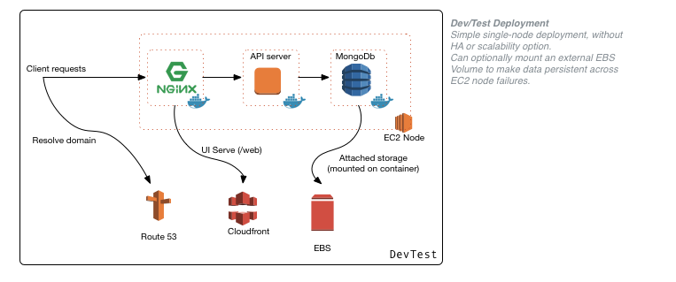
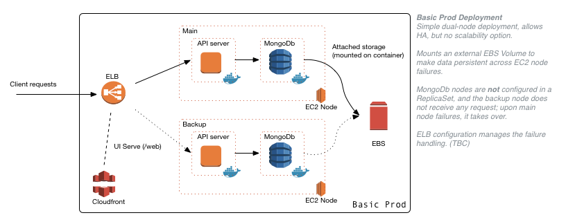
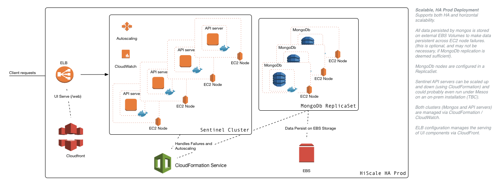

==========================================
Sentinel - API-driven User Management SaaS
==========================================

.. image:: https://travis-ci.org/massenz/sentinel.svg?branch=develop
  :target: https://travis-ci.org/massenz/sentinel

.. image:: https://coveralls.io/repos/massenz/sentinel/badge.png?branch=develop
  :target: https://coveralls.io/r/massenz/sentinel?branch=develop

:Author: Marco Massenzio (marco@alertavert.com)
:Version: 0.3
:Last Updated: 2016-01-10

Goals
-----

Implement a very easy-to-use, yet secure API-driven service to enable application developers to
manage user access and permission management for their mobile and online web applications.

Design goals (in decreasing importance order):

- REST-based, and easy to use;
- Easy to deploy in a SaaS model;
- Secure from unauthorized access;
- Simple to deploy in a modern[2]_ on-premise installation.

User Stories
------------

This project is managed via `Pivotal Tracker's Sentinel`_ project.

License
-------

We plan to eventually open source all the code under the Apache 2.0 License.

However, until development is complete and a release is ready, we need to keep the
copyright tight, so as to avoid unwanted forking.

The code is free to browse, copy and reuse in other projects as desired (attribution
and a link to this project would be appreciated, but not required).

Please include the following alongside your source code::

    // Copyright (c) 2015-2016 AlertAvert.com, all rights reserved.
    // Please see: http://github.com/massenz/sentinel

Architecture
------------

We use the `Scala Play`_ framework for the REST API, and core Scala for the backend implementation;
the persistence layer uses MongoDB (Casbah_).

The UI is a very simple `Angular JS`_ application, meant mostly to exercise the API and test out
features and functionality of the backend.

When deployed locally (or in its most basic Cloud configuration), the frontend is an Nginx_
reverse proxy, serving the static (HTML / JavaScript) files for all ``/web/*`` URLs; the backend
runs the `Scala Play`_ server (serving all ``/api/v?/*`` URLs) and finally the data layer
is composed of a single-instance standalone MongoDB server:

Obviously, this configuration does not provide either High Availability (HA) nor scalability;
a better way to achieve a basic level of HA (in the face of physical node failures) is to
deploy two identical nodes (one "main" and the other "backup") and take advantage of either
AWS's `Elastic Load Balancer`_ (ELB), or Nginx_ if deployed on-premise, to redirect
traffic to the "backup" node (which becomes the "main" node):

Even though this provides a basic level of redundancy and thus HA in the face of physical node
failures, it is still not suitable for high-volume scenarios, where also elastic horizontal
scaling may be needed.

To achieve full horizontal scalability, we deploy the `MongoDB ReplicaSet`_ in its own cluster,
while the API servers are deployed in their own `AWS CloudFormation`_-managed cluster:

Internal Architecture
+++++++++++++++++++++

``TODO``

Users and Organizations
+++++++++++++++++++++++

``TODO``

Permissions Management
++++++++++++++++++++++

``TODO``

Build & Test
------------

This is an SBT project and is managed and built via ``sbt``.
To build it (and run unit tests) the easiest way is to use a helper script::

    $ ./bin/run_tests.sh

This will require a Configuration_ file for the tests that we expect to be placed in::

    ${HOME}/.sentinel/tests.conf

this file is not under source control and contains values that are specific to the local
environment (development); the easiest way to create it is to copy the ``conf/tests.conf``
file and adjust its values.

To run correctly, the tests need an active MongoDB server; see Deployment_ for more details.

Deployment
----------

This project is meant to be tested and deployed using Docker containers, which is currently
the only supported way of deploying and running (even locally).

**NOTE** the following assumes a Linux OS environment, on OS X you will need to use
`Docker Machine`_ or a running Linux VM to make this all work.

**TODO** We should really use Docker Compose for the following, this will change soon.

A very temporary solution has been implemented in ``bin/run_service.sh`` to automate
the process below, with a few supporting Python scripts to build the docker images;
**use with caution** as it has not been tested and will probably break without some
adjustment to your development environment.

MongoDB
+++++++

``Sentinel`` requires a backing MongoDB server, whose address needs to be configured via
the ``db_uri`` flag in the ``application.conf`` file (see Configuration_ below).

When running tests, the server's address should be defined via the ``db_uri``
property in the ``${HOME}/.sentinel/tests.conf`` configuration file
(see the ``bin/run_tests.sh`` script).

To run a MongoDB server, just use the default container from `DockerHub Mongo image`_
using, for example::

    $ docker run -p 27017:27017 --name mongo-dev mongo

which gives access to a ``mongod`` on ``localhost:27017`` (the default).

API Server (Sentinel)
+++++++++++++++++++++

This is slightly more convoluted, mostly due to the use of `sbt docker plugin`_, which is
not very well documented and has several limitations[1]_.

The full build process is in ``bin/build-api-server.py`` and results in a Docker image::

    DOCKER_IMAGE = 'massenz/sentinel-apiserver'

**TODO** add versioning.

During the image build process, we amend the ``bin/sentinel`` launch script, by altering
the ``CLASSPATH``, using the ``build/fix_bin.py`` script.

**TODO** this may no longer be necessary; we could use a ``-Dconfiguration.file``
directive instead.

Nginx (front-end)
+++++++++++++++++

This step is not strictly necessary for development/testing, as the UI is served by the Play server
too; however, this is how it will be deployed in Production eventually.

The base image is at `DockerHub Nginx image`_; use the script in ``build/build-web-proxy.py``
to create the image (use with ``--help`` to view options).

Once the Docker image is built, it can be run with::

    $ docker run --name sentinel-frontend --link sentinel-api \
        -p 8080:80 -p 8083:443 \
        -d massenz/sentinel-nginx

at this point the login screen should be reachable at ``http://<docker-host-ip>:8080/web/``.

SSL (HTTPS) Support
^^^^^^^^^^^^^^^^^^^

`Nginx`_ supports SSL termination out of the box, but it requires the creation of a ``X.509``
certificate and associated key.

Following the instructions from `Digital Ocean`_ we can create both and place them in the
``build/`` folder for the ``build-web-proxy.py`` script to pick::

    $ sudo openssl req -x509 -nodes -days 365 -newkey rsa:2048 \
        -keyout build/nginx.key -out build/nginx.crt

In the ``Dockerfile`` they get copied to the appropriate folder in the container::

    COPY nginx.crt /etc/nginx/sentinel.crt
    COPY nginx.key /etc/nginx/sentinel.key

If you now try to reach the server on ``https://<docker-host-ip>:8083/web/`` the browser
will complain (as this one is not really a valid certificate, authenticated by a CA)
but will eventually relent if you click enough "accept" buttons.

**NOTE** the name of the server used in the URL and the domain given when creating
the Cert **MUST match**.

**TODO** This step will eventually be added to the ``build-web-proxy.py``, but with a valid cert.

Complete deployment
+++++++++++++++++++

The whole process is currently automated via::

    bin/run_service.sh

but, as noted above, this is still **very experimental**.

If all goes well, you should be able to see the running containers::

    $ eval $(docker-machine env sentinel)
    $ docker ps
    CONTAINER ID IMAGE                        COMMAND                 PORTS                          NAMES
    e70ebbaa94f7 massenz/sentinel-nginx       "nginx -g 'daemon off"  443/tcp, 0.0.0.0:8080->80/tcp  sentinel-ui
    92219c39c25c massenz/sentinel-apiserver   "bin/sentinel"          0.0.0.0:9000->9000/tcp         sentinel-api
    ed10483c75d6 mongo                        "/entrypoint.sh mongo"  27017/tcp                      mongo-dev

and you can connect to the Sentinel UI on ``http://localhost:8080/web/``
(**note: the trailing slash is important**).

Configuration
-------------

Currently the main configuration is managed via two files::

    conf/application.conf
    build/override.conf

the latter *must* be moved to the ``conf/`` dir prior to building the docker image (see Deployment_)
for its settings to be picked up.

In the built container, they will be placed in the ``/etc/sentinel`` folder, which is also
added to the ``CLASSPATH``, so changes to those files will be picked up upon server restart.

**NOTE** copies are also kept in ``/opt/sentinel/conf``, but changes to those will **not** be
reflected in the running server.

The main flags of interest (see the ``application.conf`` file for more details) are::

    # The bootstrap file
    application.bootstrap.file = "test/resources/bootstrap.json"

    application.signature.validate = false

    # Database configuration, requires a URI of the form `mongodb://host[:port]/dbname`
    db_uri = "mongodb://example.com:9999/sentinel-test"

bootstrap.file
  is the full path of a JSON file that defines users that will be created (or updated) at server
  start and will be the "seeds" to manage/create more users.

  See the ``conf/bootstrap.json`` file for an example of the format.

signature.validate
  every API request must be authenticated via an API Key to be passed in the ``Authorization``
  header: if this flag is ``false`` there will be no validation step (this is
  **a serious security vulnerability**).

  The header **must** be of the form::

      Authorization: username=myuser;api-key=abf334uf.....kkafei==

  See `API Key`_ for more details.

db_uri
  This is the location for the MongoDB server and must be in a MongoDb-compatible format
  (as shown above).

  This is **not** used for tests; use instead the ``-Dsentinel.test.db_uri`` system property
  (or, even better, the ``run_tests`` script: see `Build & Test`_).

Override
++++++++

The preferred way of making changes to the configuration (both during development and in production)
would be to make changes to the ``overrride.conf`` file and leave the ``application.conf`` file
alone.

The file should be placed in the ``conf/`` folder (alongside the ``application.conf``) and will
be picked up when the server start: as it's included as the last line in the configuration
file, any keys that are redefined there will supersede the values in the ``application.conf``.

See the example in ``override.conf.sample`` -- keep ``override.conf`` outside of source control.

API Key
+++++++

For every user, a pseudo-random API Key is generated dynamically (but deterministically) by
the server; to retrieve a given user key, use the ``/login`` endpoint (see `API Docs`_ for
more details on the endpoints).

Upon successful authentication with the correct password, the server will respond with the API Key;
this can be subsequently used for all requests by the same user.

----

**Notes**

.. [1] Assumes Linux OS, support for Docker and service discovery/routability.

.. [2] See the ``sentinel.Dockerfile`` for a list of the necessary changes to make the
       container runnable; also, the ``bin/fix_bin.py`` script provides an example of the
       changes necessary to make the configuration files available in the ``CLASSPATH`` in
       such a way that does not require to rebuild it from scratch every time a configuration
       change is necessary (that would be unworkable in deployment).

.. _Pivotal Tracker's Sentinel: https://www.pivotaltracker.com/n/projects/1082840

.. _DockerHub Nginx image: https://registry.hub.docker.com/_/nginx/
.. _DockerHub Mongo image: https://registry.hub.docker.com/_/mongo/
.. _Docker Machine: https://docs.docker.com/machine/

.. _Nginx: https://www.nginx.com/resources/admin-guide/nginx-ssl-termination/
.. _Digital Ocean: https://www.digitalocean.com/community/tutorials/how-to-create-an-ssl-certificate-on-nginx-for-ubuntu-14-04

.. _Scala Play: https://www.playframework.com
.. _Casbah: https://mongodb.github.io/casbah/
.. _sbt docker plugin: http://www.scala-sbt.org/sbt-native-packager/formats/docker.html
.. _Angular JS:

.. _API Docs: TODO

.. _AWS CloudFormation: https://aws.amazon.com/documentation/cloudformation/
.. _Elastic Load Balancer: https://aws.amazon.com/elasticloadbalancing/

.. _MongoDB ReplicaSet: https://docs.mongodb.org/manual/tutorial/deploy-replica-set/
